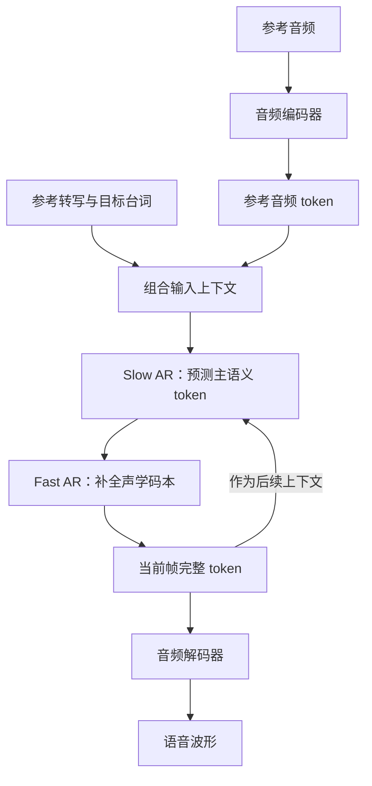

# Fish Speech KV Cache 推理优化记录

相关贡献：[Fish Speech PR #1312](https://github.com/fishaudio/fish-speech/pull/1312)，已合并

我在给角色短剧制作日语配音时使用了 Fish Speech S2-Pro。它在我的参考音频和台词上，音色一致性比较可靠，但本地生成速度仍然影响使用体验。于是，我从实际推理过程入手，定位到了一处可以减少冗余工作的地方：每一步注意力计算接收到的 KV cache，包含了大量尚未使用的容量。

这次优化保留 KV cache 的完整预分配空间，只让注意力读取当前有效的前缀。在我提交的基准中，GV100 的原生 eager 推理吞吐达到原来的 **4.60 倍**，`torch.compile` 模式达到 **1.97 倍**；维护者随后在 H200 上独立测得 **2.14 倍**和 **1.65 倍**的提升。它们都是特定条件下的自回归生成吞吐结果，具体条件和验证范围会在后文说明。[原始基准](https://github.com/fishaudio/fish-speech/issues/1310) · [维护者复测](https://github.com/fishaudio/fish-speech/pull/1312#pullrequestreview-4999746332)

## 1. 为什么从 Fish Speech 入手

我的使用场景是逐句生成角色对白，主要是用日语参考音频合成日语台词。这类任务既需要发音和情绪自然，也需要同一个角色连续说多句话时保持音色一致。

在我之前的使用中，Qwen3-TTS 有时会出现音色漂移。我为此接入了 RoleTone，给结果评分，低分就重新生成。这个办法可以减少一部分人工复听，但评分模型本身也有偏差，仍然需要人的判断。Fish S2-Pro 在我这组素材上的表现更稳定，复听和重生成的负担明显较小，因此我更愿意继续优化它的速度。

这里描述的是我的项目体验，不是统一测试集上的模型排名。参考音频、文本、采样配置和模型版本都会影响结果。对我的工作流来说，真正关心的是得到一条可用配音需要多久，这里面还包括重试和检查的时间。

## 2. Fish Speech 是怎样把文字变成语音的

Fish Speech 是项目名称，本文讨论的具体模型是 S2-Pro。理解这次优化，需要先知道它的两个主要部分：**音频编解码器**和 **Dual-AR 生成模型**。

音频编解码器把连续的波形压缩成离散 token。S2 使用 10 层 RVQ 码本，帧率约为 21 Hz：第一层侧重语义，后面九层补充声学细节。因此，一帧音频由一组码本 token 表示，而不是单个文字 token。生成完成后，编解码器再把这些 token 还原为波形。[S2 技术报告：音频表示](https://arxiv.org/html/2603.08823v1#S2.SS1)

Dual-AR 把生成过程拆成两个方向：

- **Slow AR 沿时间推进。** 较大的 Transformer 读取文本和历史音频上下文，预测下一帧的主语义 token，并给出隐藏状态。
- **Fast AR 在当前帧内补全码本。** 较小的 Transformer 根据这些条件，依次生成剩余声学 token。

这样就不需要让大模型沿时间轴逐个生成全部十层码本。Slow AR 主要承担跨帧建模，Fast AR 处理帧内细节。[S2 技术报告：Dual-AR](https://arxiv.org/html/2603.08823v1#S2.SS2)



这是针对参考音频克隆场景的简化示意。参考声音以条件信息进入推理过程，使用时无需为每个角色重新训练模型。本文优化的位置是原生 PyTorch 自回归推理中的注意力与 KV cache 路径。[官方推理流程](https://github.com/fishaudio/fish-speech/blob/214da3cd841bda85da2496b96cd3c4d7edb1337e/fish_speech/models/text2semantic/inference.py)

## 3. 与 Qwen3-TTS、IndexTTS 的关系

这几个项目都支持从参考音频生成新语音，但生成链路和控制方式有所不同。下面按公开实现作简化对比；它不表示同等硬件下的速度或音质排名。

| 项目与版本 | 生成链路概括 | 与角色配音有关的特点 |
|---|---|---|
| Fish Speech S2-Pro | Slow AR 生成主语义 token，Fast AR 补全码本，再由 codec 解码 | 支持参考音频克隆、文本内情绪标签、多说话人及多轮生成 |
| Qwen3-TTS 12Hz 系列 | 主干预测第一层码本，MTP 模块生成其余码本，因果解码器还原波形 | 支持日语；Base 用于参考音频克隆，CustomVoice 和 VoiceDesign 分别面向预设音色控制、描述式音色设计 |
| IndexTTS-2 / 2.5 | 自回归模型生成语音表示，经过语义到梅尔谱的声学模块与声码器生成波形 | 强调音色与情绪分离控制；2.5 增加日语等语言支持及假名、语速控制 |

来源：[Fish Speech 官方说明](https://github.com/fishaudio/fish-speech) · [Qwen3-TTS 官方模型说明](https://github.com/QwenLM/Qwen3-TTS#released-models-description-and-download)及[技术报告](https://arxiv.org/html/2601.15621v1#S3.SS1) · [IndexTTS 官方说明](https://github.com/index-tts/index-tts)及[推理代码](https://github.com/index-tts/index-tts/blob/main/indextts/infer_v2.py)。对比资料核对于 2026-09-17。

Fish 和 Qwen3-TTS 都采用了分层生成多码本的思路，因此不能仅用“自回归”和“非自回归”来区分它们。实际速度还取决于模型规模、音频帧率、注意力实现、编译方式和硬件。

IndexTTS-2.5 是在 2026 年 8 月发布的，比我最初定位 Fish 性能问题和提交 PR 更晚。它属于后续选型比较，不能写成这次优化开始前就完成的对照实验。我对 IndexTTS 的服务封装工作也与本次 Fish 推理优化分开记录。[IndexTTS 发布时间](https://github.com/index-tts/index-tts#-news)

## 4. 瓶颈：有因果 mask，仍然传入了完整缓存

自回归生成会反复读取历史信息。KV cache 将历史 token 的 Key 和 Value 保存起来，避免每一步重新计算历史投影。为了便于写入，程序可以事先按最大上下文长度分配缓存。

问题在于，**缓存的分配容量和当前需要读取的长度，是两个不同的量。**

在当时的原生实现中，`KVCache.update()` 返回完整的预分配 K/V；随后程序用 `repeat_interleave` 扩展 KV heads，再将完整长度的张量传入 PyTorch SDPA，也就是 scaled dot-product attention。因果 mask 会屏蔽未填充的尾部，但传入张量的 K 维仍然等于最大缓存容量。[原始实现与问题记录](https://github.com/fishaudio/fish-speech/issues/1310)

我测试的 S2-Pro 配置中，`max_seq_len=32768`，prompt 只有 234 个位置，生成结束时上下文也只有约 400 个位置。实际使用的缓存占比约为 0.7%～1.3%。

| 量 | 当时的示例 |
|---|---:|
| 物理 KV cache 容量 | 32768 个位置 |
| 已填充的有效前缀 | 约 234～400 个位置 |
| 优化前送入 SDPA 的 K/V 长度 | 32768 |
| 优化后送入 SDPA 的 K/V 长度 | 当前有效前缀长度 |

此外，模型使用 32 个 query heads、8 个 KV heads，原生路径需要把 KV heads 扩展四倍。在 FP16、head dimension 为 128 时，完整长度扩展后的 K 和 V 合计对应：

```text
2 × 32 × 32768 × 128 × 2 bytes = 512 MiB / layer
```

这里是扩展张量的逻辑数据量估算，不是额外常驻显存，也不是实测 DRAM 流量；编译器和算子实现会影响实际开销。它说明了为什么要在 head 扩展之前减少长度。[配置与估算依据](https://github.com/fishaudio/fish-speech/issues/1310)

这次定位能够直接证明的是：程序扩展并传入了完整 K/V。不同 SDPA 后端如何处理 masked tail，不能仅凭 mask 或张量形状下结论，最终收益需要通过 A/B 测试确认。

## 5. 修改：保留容量，只读取 active prefix

我的方案保留完整缓存及原地写入逻辑，把有效长度 `kv_len` 沿生成调用链传下去，再同时收窄 mask、K 和 V 的长度。

| 阶段 | `kv_len` |
|---|---|
| Prompt prefill | `T`，即 prompt 长度 |
| 第一次 decode | `T + 1` |
| 后续第 `i` 次 decode，从 0 计数 | `T + i + 1` |

关键操作可以简化成下面的伪代码。实际代码以 mask 的最后一维作为 attention 层的有效 K 长度：

```python
# 先更新完整的物理缓存。
k, v = kv_cache.update(input_pos, k, v)

# 在扩展 heads 之前，只取已填充的前缀。
k = k[:, :, :kv_len]
v = v[:, :, :kv_len]
mask = causal_mask[None, None, input_pos, :kv_len]

k = k.repeat_interleave(n_head // n_local_heads, dim=1)
v = v.repeat_interleave(n_head // n_local_heads, dim=1)
output = scaled_dot_product_attention(q, k, v, attn_mask=mask)
```

源码位置：[合并版本的 llama.py](https://github.com/fishaudio/fish-speech/blob/214da3cd841bda85da2496b96cd3c4d7edb1337e/fish_speech/models/text2semantic/llama.py)。

这相当于只读取仓库里已经放了东西的货架。预留的空间仍然存在，后续生成仍可继续写入。它也不同于滑动窗口：有效前缀内的历史没有被丢弃，只去掉尚未使用的尾部。

因此，这次修改不需要重新训练或量化，也没有通过缩小最大上下文来换取速度。主要收益来自减少 head 扩展与注意力路径中的冗余张量处理。训练使用的普通 full-sequence `forward()` 不走这条推理 KV cache 路径。[PR 变更说明](https://github.com/fishaudio/fish-speech/pull/1312)

最终实现还补齐了几处工程细节：

- **长度传递。** 正常生成路径直接从 Python 循环传入位置，避免仅为计算 `kv_len` 而逐步调用设备 tensor 的 `.item()`；旧的直接调用方式仍有兼容回退。
- **边界校验。** 检查前缀长度和写入位置，防止越界或读取范围错误。CPU/CUDA 使用相应的异步断言路径；其他后端保留 eager 校验。因此，不能把最终实现概括成所有后端都完全没有同步。
- **编译兼容。** 添加 `dynamic=True`，并用测试检查前缀增长时的图复用。动态长度的编译行为需要专门验证。
- **旧回调兼容。** 判断自定义 decode 回调是否接收 `kv_len`，避免新增参数直接破坏已有调用方。

这些改动与测试都保留在[最终 diff](https://github.com/fishaudio/fish-speech/pull/1312/files)中。

## 6. 效果：我自己的基准与维护者的独立复测

下面将几组结果放在一起。每行只比较同一设备、同一路径下的优化前后；MPS 的服务诊断指标与 CUDA CLI 的统计口径不同，不作跨设备绝对速度比较。

| 设备与路径 | 优化前 | 优化后 | 吞吐倍数 | 测试来源 |
|---|---:|---:|---:|---|
| M4 Pro 48 GB，MPS FP16 | 4.08 frames/s | 8.31 frames/s | **2.04×** | 我的服务诊断，`max_seq_len=4096` |
| Quadro GV100 32 GB，CUDA eager | 2.73 tok/s | 12.57 tok/s | **4.60×** | 我的原生 CLI 基准 |
| Quadro GV100 32 GB，`torch.compile` | 16.65 tok/s | 32.74 tok/s | **1.97×** | 我的原生 CLI 基准 |
| H200，CUDA eager | 9.22 tok/s | 19.73 tok/s | **2.14×** | 维护者独立复测 |
| H200，`torch.compile` | 68.60 tok/s | 113.33 tok/s | **1.65×** | 维护者独立复测 |

我自己的 CUDA 测试使用相同模型、参考 tokens、目标文本、采样参数和 seed；每种模式生成四次，第一次作为 warm-up，报告后三次吞吐的中位数。编译模式的第一次还包含编译，因此不计入稳态比较。

| CUDA 基准条件 | 配置 |
|---|---|
| 模型与精度 | S2-Pro，FP16 |
| 硬件、系统 | Quadro GV100 32 GB，Ubuntu x86_64 |
| 软件 | Python 3.12，PyTorch 2.8.0+cu128，Triton 3.4.0 |
| 缓存容量、prompt 长度 | 32768、234 |
| Seed | 42 |
| 采样参数 | `temperature=0.8`、`top_p=0.8`、`top_k=30` |
| 输出上限 | `max_new_tokens=1024` |
| 对照提交 | 基线 `e5e2926`，优化原型 `c4146e7` |

由于 FP16 数值差异可能改变随机采样轨迹，生成长度略有不同，所以用生成 token 数除以时间进行比较，而不是只比较整次请求耗时。完整设置与逐次数据见[原始 issue](https://github.com/fishaudio/fish-speech/issues/1310)。

GV100 的峰值 CUDA reserved memory 也有所下降：

| 模式 | 优化前 | 优化后 |
|---|---:|---:|
| Eager | 17.33 GB | 15.16 GB |
| `torch.compile` | 15.72 GB | 15.16 GB |

这里按日志使用十进制 GB，指标为 `torch.cuda.max_memory_reserved() / 1e9`。它包括 PyTorch 分配器保留的空间，不能等同于模型权重大小或常驻 KV cache 大小；物理缓存容量在这次修改中仍然保留。

**这些结果有明确的适用范围。** 它们测量的是原生自回归生成路径，不能直接当作完整 TTS 服务的加速倍数。参考音频处理、codec 解码和服务开销还需要计入端到端耗时；它们也不代表 SGLang 等独立推理后端会获得相同收益。我的主要基准只使用了一组目标文本和参考音频，冷启动与冷编译时间没有纳入。

此外，GV100/MPS 数字来自提交时的优化原型，H200 数字来自维护者在 8 月 review 时检查的版本。后续又加入了校验、编译和兼容性修改。现有公开记录没有提供对最终合并快照的同条件完整重测，因此这里把数据明确标为各阶段的验证结果。

## 7. Review：加速之外，还要定义正确性

维护者认可了性能收益，但要求把回归测试保留在仓库里。这个要求很关键：注意力有效长度改变后，底层归约和编译执行可能产生浮点差异；在自回归采样中，一点差异又可能改变后续整条生成轨迹。

在 H200 的 FP16 对比中，维护者观察到前五个 decode 位置的 argmax 一致，但最大 logit 绝对差达到 `0.078125`；相同 seed 的完整生成中，630 个声学码元素有 170 个不同。这个比例描述的是离散输出差异，不能解读为“约 27% 的语音错误”，也不能单凭它认定音质下降。[review 记录](https://github.com/fishaudio/fish-speech/pull/1312#pullrequestreview-4999746332)

我据此补充了不同层次的验证。最终合入的测试文件包含七个测试方法：

| 检查内容 | 要回答的问题 |
|---|---|
| Attention 输入形状 | SDPA 是否只收到有效前缀，而物理缓存仍保持完整容量？ |
| Float32 数值比较与 argmax | active-prefix 与完整缓存加 mask 的输出是否在明确容差内一致？ |
| 长度和位置边界 | 最小、最大合法值以及非法长度、位置是否得到正确处理？ |
| Prefill / decode 推进 | mask、K、V 的有效长度是否同步增长？ |
| 真实 AR 调用链 | 生成形状、slow/fast logits、概率分布和 greedy tokens 是否满足约定？ |
| 旧 decode 回调 | 不接收 `kv_len` 的调用方式是否仍能使用？ |
| 动态编译图 | 小型测试中，多步 decode 是否复用同一个动态计算图？ |


数值测试采用 `rtol=1e-5`、`atol=1e-6`；生成回归使用 `top_k=1` 的确定性配置，检查 token 一致性。这里的“真实调用链”指自回归生成链，并不包含完整音频 codec 和 HTTP 服务。动态编译测试使用计数 backend，也不能替代所有 GPU、所有编译器版本上的性能测试。

我还对四组代表性 CUDA 输出进行了解码和人工试听，未听出明显退化。但试听样本有限，这不等于完成了大规模盲测或客观音质评估。数值测试、生成测试和试听分别提供不同层面的证据。